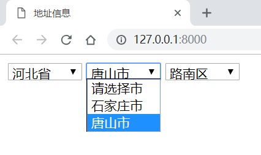
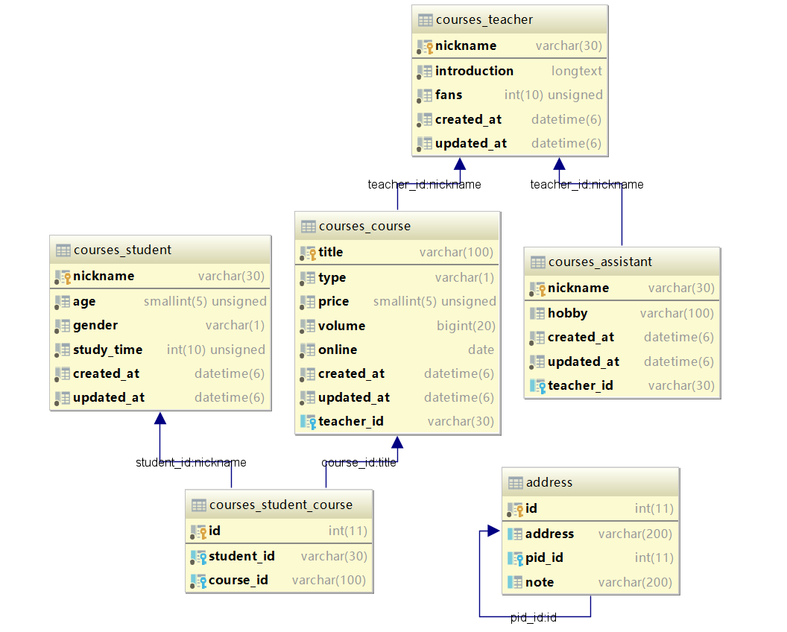
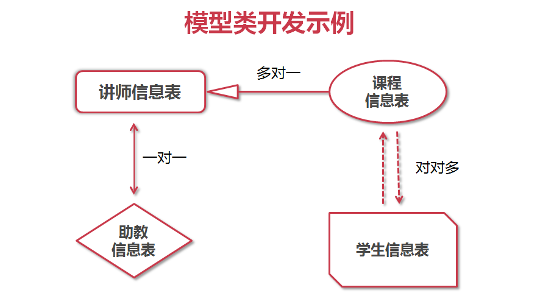

# 开发环境

Windows/MacOS/Linux，搭建Django开发环境：

- 前端：HTML/CSS + jQuery 3.3
- Django 1.11
- Python 3.6
- MySQL 5.7

数据库操作：

```mysql
# 创建数据库imooc
create database imooc charset utf8;
# 切换到imooc库
USE imooc;
/*root：所有权限，只能localhost连接*/
GRANT ALL PRIVILEGES ON *.* TO 'root'@'localhost' WITH GRANT OPTION;
FLUSH PRIVILEGES;
```

# 效果演示

通过刷新前端，触发ORM操作



MySQL数据表（Django自带的数据表除外）



# 课程内容

> 中级课程。由浅入深全面掌握Django ORM开发的知识，以Django官方文档为依据，内容完整、准确、权威

## 第1章 课程介绍

### 1.1 课程内容与导学

介绍本课程的学习内容和目标，如何学习本课程，引导学生对Django ORM有一个基础且全面的了解，并能够在课程结束后独立使用Django完成ORM的开发。

## 第2章 ORM介绍

### 2.1 什么是ORM

Django ORM介绍，模型类的概念、由来、优势、劣势。

## 第3章 字段类型和参数

### 3.1 常用的字段

全面介绍Django ORM中所有的字段。

### 3.2 关系型字段

一对一（OneToOneField）；多对一（ForeignKey）；多对多（ManyToManyKey），默认中间表。

### 3.3 字段参数

详解所有字段都有的公共参数和个别字段的私有参数。

### 3.4 自关联

以”省-市-县-村“为例，如何在一张表中实现自关联存储。

## 第4章 元数据Meta

### 4.1 元数据介绍

讲解元数据的概念，举例常用的元数据。

## 第5章 Django数据表操作

### 5.1 Django更改数据表

介绍migrations文件夹，django_migrations表的含义；Django ORM如何创建与更改数据表。

### 5.2 Django数据导入

使用`python manage.py shell/loaddata`写入，使用脚本或`creat()`、`bulk_create()`批量导入。

### 5.3 Django数据导出

通过` python manage.py dumpdata`导出数据，或用数据库自带的导出命令。

## 第6章 Models API

### 6.1 查询集QuerySet介绍

查询集QuerySet介绍，如何创建、保存、检索、过滤；

字段数据正则匹配，大小写敏感；

结果切片，排序，链式查询；

如何查看与执行生SQL语句。

### 6.2 返回新QuerySet的API

| Models API            | 使用说明                                       |
| --------------------- | ---------------------------------------------- |
| **filter()**          | 过滤查询对象                                   |
| **exclude()**         | 排除满足条件的对象                             |
| **annotate()**        | 使用聚合计数，求和，平均数等                   |
| **order_by()**        | 对查询集进行排序                               |
| **reverse()**         | 反向排序                                       |
| **distinct()**        | 对查询集去重                                   |
| **values()**          | 返回包含对象具体值的字典的QuerySet             |
| **values_list()**     | 与values()类似，只是返回的是元组而不是字典     |
| dates()               | 根据日期获取查询集                             |
| datetimes()           | 根据时间获取查询集                             |
| **none()**            | 创建空的查询集                                 |
| **all()**             | 获取所有的对象                                 |
| union()               | 并集                                           |
| intersection()        | 交集                                           |
| difference()          | 差集                                           |
| `select_related()`    | 附带查询外键关联的对象，优化一对一，多对一查询 |
| `prefetch_related()`  | 预先查询外键关联的对象，优化一对多，多对多查询 |
| extra()               | 实现别名，条件，排序等                         |
| defer()               | 排除不需要的字段                               |
| only()                | 仅选择需要的字段                               |
| using()               | 选择数据库                                     |
| `select_for_update()` | 锁住选择的对象，直到事务结束                   |
| raw()                 | 接收一个原始的SQL查询                          |

### 6.3 不返回QuerySet的API

| Models API             | 使用说明                           |
| ---------------------- | ---------------------------------- |
| **get()**              | 获取单个对象                       |
| **create()**           | 创建对象，无需save()               |
| **get_or_create()**    | 查询对象，如果没有找到就新建对象   |
| **update_or_create()** | 更新对象，如果没有找到就创建对象   |
| `bulk_create()`        | 批量创建对象                       |
| **count()**            | 统计对象的个数                     |
| `in_bulk()`            | 根据**主键值**的列表，批量返回对象 |
| `iterator()`           | 获取包含对象的迭代器               |
| **latest()**           | 获取最近的对象                     |
| **earliest()**         | 获取最早的对象                     |
| **first()**            | 获取第一个对象                     |
| **last()**             | 获取最后一个对象                   |
| **aggregate()**        | 聚合操作                           |
| **exists()**           | 判断queryset中是否有对象           |
| **update()**           | 批量更新对象                       |
| **delete()**           | 批量删除对象                       |
| as_manager()           | 获取管理器                         |

### 6.4 自定义聚合查询

实现一个自定义的聚合查询功能，比如group_concat。

## 第7章 F对象与Q对象

### 7.1 F对象与Q对象的使用

如何使用F对象操作字段的数据，使用Q对象实现复杂的查询，结合AND, OR, NOT, |, ~, &操作。

## 第8章 课程总结

### 8.1 课程总结



在本课程中，我们通过开发4个具有关联关系的模型类（讲师、课程、学生、助教），把所有知识串联起来，全面的讲解了Models的开发知识。更高级的内容，如自定义字段、自定义管理器、自定义中间表和模型类的继承，欢迎关注后续课程。